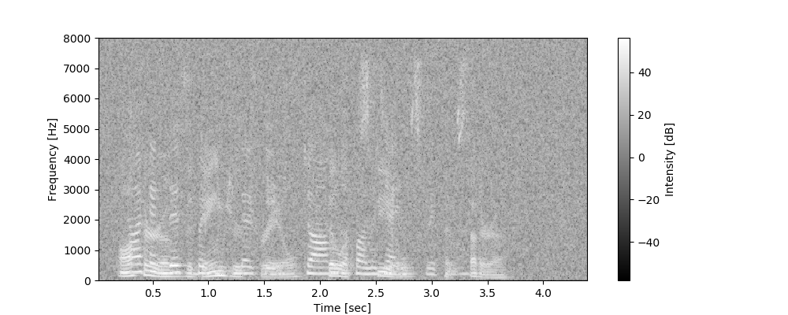

## 正誤表
|項番|該当箇所|誤|正|update|
|---|---|---|---|---|
|1|p.2| pip install itertools | 削除　|2020/08/24|
|2|p.10| 「知り当たった」|「知り合った」|2020/08/24|
|3|第二章|code2.1とcode2.9が欠番。（コードを削除したことに起因）|-|2020/08/24|
|4|p.60|code2.14|code2.15|2020/08/24|
|5|p.97|code3.9|result3.1|2020/08/24|
|6|p.82| 「このとき、m<Mでβmは0となり、」|「このとき、m<Mでβmは0となることがありますが、」|2020/08/24|
|7|p.151| 図5.5||2020/08/24|
|7|p.175| mic_alignments = np.array（［ ［［x,0.0,0.0］ for x in np.arange（-0.31,0.32,0.02）］ ］　） |  mic_alignments = np.array（ ［［x,0.0,0.0］ for x in np.arange（-0.31,0.32,0.02）］ 　）　|2020/08/24|
|8|p.228| 「音声のスパース性に基づく音源分離の実行結果（マイクロホンの間隔40センチ）」|「音声のスパース性に基づく音源分離のソースコード（マイクロホンの間隔40センチ）」|2020/08/24|
|9|p.238| 「スパース性を利用した音源分離の実行例（マイクロホン間隔40センチ）」|「スパース性を利用した音源分離の実行例（マイクロホン36素子）」|2020/08/24|
|10|p.326の表10-1の数値| LGM「14.69」、LGM＋Dreverb「20.71」|LGM「13.89」、LGM＋Dreverb「19.91」|2020/08/24|
|11|p.336の表10-2の数値| ILRMA「14.38」、ILRMA+Dereverb「19.62」、ILRMA-T「18.05」|ILRMA「13.58」、ILRMA+Dereverb「18.82」、ILRMA-T「17.25」|2020/08/24|
|12|p.340|「無残響環境と残響環境の二つの環境で実行しています。」 |「残響環境で実行しています。」|2020/08/24|

